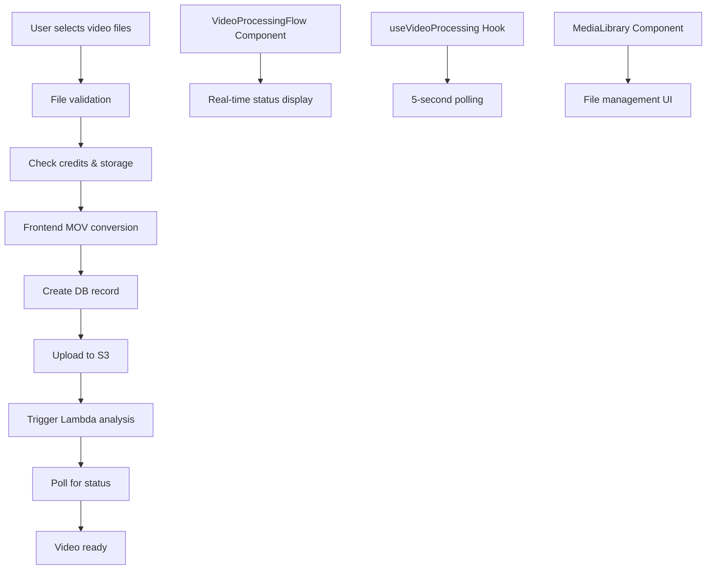
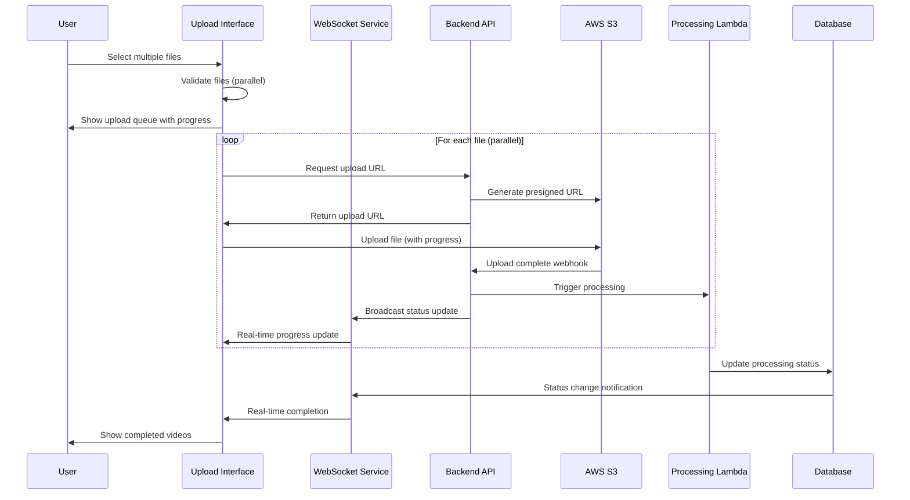

# Video Upload System Analysis & Improvement Plan

## Current System Architecture

### Overview
The current video upload system is a Next.js application with Remotion timeline editing capabilities, using AWS S3 for storage, Supabase for database, and AWS Lambda for video processing.

### Current Flow Diagram



### Component Architecture

```
┌─────────────────────────────────────────────────────────────┐
│                    MediaLibrary.tsx                         │
├─────────────────────────────────────────────────────────────┤
│ • File selection (drag/drop, file picker)                  │
│ • Validation & credit checking                             │
│ • Frontend MOV→MP4 conversion                              │
│ • S3 upload coordination                                   │
│ • Sequential bulk upload processing                        │
└─────────────────────────────────────────────────────────────┘
                              │
                              ▼
┌─────────────────────────────────────────────────────────────┐
│                VideoProcessingFlow.tsx                      │
├─────────────────────────────────────────────────────────────┤
│ • Real-time processing status UI                           │
│ • Upload progress visualization                            │
│ • Three states: Uploading → Analyzing → Ready             │
└─────────────────────────────────────────────────────────────┘
                              │
                              ▼
┌─────────────────────────────────────────────────────────────┐
│                useVideoProcessing.ts                        │
├─────────────────────────────────────────────────────────────┤
│ • Status polling (5-second intervals)                      │
│ • Real-time database subscriptions                         │
│ • State management for processing videos                   │
└─────────────────────────────────────────────────────────────┘
```

## What's Broken: Critical Issues

### 1. **Performance Bottlenecks**
- **Sequential Processing**: Bulk uploads process files one at a time instead of parallel
- **Frontend Conversion**: Large MOV files (>300MB) block the UI during conversion
- **Fixed Polling**: 5-second polling regardless of processing load
- **Memory Consumption**: Video conversion can consume gigabytes of RAM

### 2. **User Experience Problems**
- **Blocking Alerts**: Users get modal alerts when clicking analyzing videos
- **Poor Progress Feedback**: Bulk upload progress shows aggregated bars without file names
- **Disappearing Videos**: Completed videos vanish from processing flow immediately
- **Confusing States**: Multiple sources of truth for video status

### 3. **Race Conditions & Timing**
- **Component Initialization**: VideoProcessingFlow ref might be null during video addition
- **Duplicate Polling**: Multiple components poll the same endpoints
- **State Synchronization**: Complex state management between components
- **Database Timing**: Processing starts before video is fully saved

### 4. **Resource Management**
- **Memory Leaks**: Blob URLs not properly revoked
- **Orphaned Files**: Failed S3 deletions leave storage bloat
- **No Cleanup**: Timers and subscriptions not cleared on unmount
- **Unbounded Growth**: No pagination for large video lists

### 5. **Error Handling Gaps**
- **Silent Failures**: Database errors logged but not shown to users
- **No Retry Logic**: Failed uploads/analysis stuck permanently
- **Generic Messages**: Conversion errors don't provide actionable feedback
- **Missing Recovery**: No way to resume interrupted operations

### 6. **Security & Validation**
- **Spoofable Validation**: File type checking only uses extensions/MIME
- **No Content Validation**: Actual video codec/format not verified
- **Credit Deduction**: 10 credits charged regardless of processing success
- **Insufficient Limits**: 20-file bulk upload could overwhelm system

## Process Flow Problems

### Current Problematic Flow
```
User Upload → Frontend Conversion → DB Save → S3 Upload → Lambda Trigger → Poll Status
     ↓              ↓                 ↓          ↓            ↓             ↓
  Blocking UI   Memory Issues    Race Condition  Slow    Duplicate Calls  Poor UX
```

### Clashing Processes
1. **Dual Polling**: VideoProcessingFlow and useVideoProcessing both poll independently
2. **State Conflicts**: Multiple components managing video processing state
3. **Resource Competition**: Frontend conversion competes with upload progress
4. **Database Contention**: Frequent polling creates unnecessary load

## Improved Architecture Design

### Recommended User Experience Flow



### Enhanced Component Architecture

```
┌─────────────────────────────────────────────────────────────┐
│                Upload Manager (New)                         │
├─────────────────────────────────────────────────────────────┤
│ • Orchestrates entire upload process                       │
│ • Manages upload queue and concurrency                     │
│ • Handles retry logic and error recovery                   │
│ • Provides unified state management                        │
└─────────────────────────────────────────────────────────────┘
                              │
        ┌─────────────────────┼─────────────────────┐
        ▼                     ▼                     ▼
┌─────────────────┐  ┌─────────────────┐  ┌─────────────────┐
│ Upload Queue UI │  │ Progress Tracker│  │ Status Monitor  │
├─────────────────┤  ├─────────────────┤  ├─────────────────┤
│ • File preview  │  │ • Per-file bars │  │ • WebSocket     │
│ • Queue mgmt    │  │ • Time estimates│  │ • Real-time     │
│ • Drag/drop     │  │ • Retry buttons │  │ • Push notifs   │
└─────────────────┘  └─────────────────┘  └─────────────────┘
```

### Technical Architecture Improvements

#### 1. **Parallel Processing Pipeline**
```
File Selection → Validation → Queue → [Upload Worker Pool] → Processing
                                            ↓
                                     [Worker 1] [Worker 2] [Worker 3]
                                            ↓
                                     Concurrent S3 uploads
```

#### 2. **WebSocket-Based Real-Time Updates**
```javascript
// Replace polling with WebSocket subscriptions
const videoStatusSocket = new WebSocket('/api/video-status');
videoStatusSocket.onmessage = (event) => {
  const { videoId, status, progress } = JSON.parse(event.data);
  updateVideoStatus(videoId, status, progress);
};
```

#### 3. **Background Processing with Web Workers**
```javascript
// Move conversion to web worker
const conversionWorker = new Worker('/workers/video-converter.js');
conversionWorker.postMessage({ file: videoFile });
conversionWorker.onmessage = ({ data }) => {
  if (data.success) {
    proceedWithUpload(data.convertedFile);
  }
};
```

#### 4. **Smart Queue Management**
```javascript
class UploadQueue {
  constructor(maxConcurrency = 3) {
    this.queue = [];
    this.active = new Set();
    this.maxConcurrency = maxConcurrency;
  }
  
  async add(uploadTask) {
    this.queue.push(uploadTask);
    this.processNext();
  }
  
  async processNext() {
    if (this.active.size >= this.maxConcurrency || this.queue.length === 0) {
      return;
    }
    
    const task = this.queue.shift();
    this.active.add(task);
    
    try {
      await this.executeWithRetry(task);
    } finally {
      this.active.delete(task);
      this.processNext();
    }
  }
}
```

## Best User Experience Design

### 1. **Progressive Upload Interface**
```
┌─────────────────────────────────────────────────────────────┐
│ Upload Videos                                    [✕] Close  │
├─────────────────────────────────────────────────────────────┤
│                                                             │
│  📁 Drop videos here or click to browse                     │
│                                                             │
│  ┌─────────────────────────────────────────────────────┐   │
│  │ video1.mp4        [████████████████████] 100%   ✓  │   │
│  │ video2.mov        [████████████████████] 100%   ✓  │   │
│  │ video3.mp4        [████████████████....] 65%    ⟳  │   │
│  │ video4.mov        [████████████████....] 0%     ⏸  │   │
│  │ video5.mp4        [Converting MOV...    ] --     ⟳  │   │
│  └─────────────────────────────────────────────────────┘   │
│                                                             │
│  Overall Progress: 3 of 5 complete                         │
│  Estimated time remaining: 2 minutes                       │
│                                                             │
│  [Pause All] [Resume All] [Cancel Remaining]               │
└─────────────────────────────────────────────────────────────┘
```

### 2. **Processing Status Dashboard**
```
┌─────────────────────────────────────────────────────────────┐
│ Processing Status                                           │
├─────────────────────────────────────────────────────────────┤
│                                                             │
│  🔄 Currently Processing (2)                               │
│  ┌─────────────────────────────────────────────────────┐   │
│  │ video3.mp4    Analyzing scenes...     [████████...]│   │
│  │ video4.mov    Converting format...    [██████......]│   │
│  └─────────────────────────────────────────────────────┘   │
│                                                             │
│  ✅ Ready to Use (3)                                       │
│  ┌─────────────────────────────────────────────────────┐   │
│  │ video1.mp4    Ready   [Add to Timeline] [Preview]   │   │
│  │ video2.mov    Ready   [Add to Timeline] [Preview]   │   │
│  │ video5.mp4    Ready   [Add to Timeline] [Preview]   │   │
│  └─────────────────────────────────────────────────────┘   │
│                                                             │
│  ❌ Failed (1)                                             │
│  ┌─────────────────────────────────────────────────────┐   │
│  │ video6.mov    Format not supported   [Retry] [Help] │   │
│  └─────────────────────────────────────────────────────┘   │
└─────────────────────────────────────────────────────────────┘
```

### 3. **Smart Error Recovery**
```
┌─────────────────────────────────────────────────────────────┐
│ Upload Error Recovery                                       │
├─────────────────────────────────────────────────────────────┤
│                                                             │
│  ⚠️  Network connection lost during upload                 │
│                                                             │
│  video3.mp4 (2.1 GB) - 47% uploaded                       │
│                                                             │
│  We'll automatically resume when connection is restored.    │
│                                                             │
│  [Retry Now] [Skip File] [Check Connection]                │
│                                                             │
│  💡 Tip: Large files upload more reliably on stable WiFi   │
└─────────────────────────────────────────────────────────────┘
```

## Technical Implementation Recommendations

### 1. **Database Schema Improvements**
```sql
-- Add upload session tracking
CREATE TABLE upload_sessions (
  id UUID PRIMARY KEY,
  project_id UUID REFERENCES projects(id),
  created_at TIMESTAMP DEFAULT NOW(),
  completed_at TIMESTAMP,
  status VARCHAR(20) DEFAULT 'active'
);

-- Enhanced video tracking
ALTER TABLE videos ADD COLUMN upload_session_id UUID;
ALTER TABLE videos ADD COLUMN upload_progress INTEGER DEFAULT 0;
ALTER TABLE videos ADD COLUMN retry_count INTEGER DEFAULT 0;
ALTER TABLE videos ADD COLUMN error_message TEXT;
```

### 2. **API Improvements**
```javascript
// Batch video status endpoint
GET /api/videos/status
Query: ?videoIds=id1,id2,id3&sessionId=session123

// WebSocket endpoint for real-time updates
WebSocket /api/ws/video-status?sessionId=session123

// Resumable upload endpoint
POST /api/upload/resume
Body: { videoId, chunkIndex, totalChunks }
```

### 3. **Frontend State Management**
```javascript
// Centralized upload state with Zustand
const useUploadStore = create((set, get) => ({
  uploadSessions: {},
  activeUploads: {},
  
  addUploadSession: (sessionId, files) => {
    set(state => ({
      uploadSessions: {
        ...state.uploadSessions,
        [sessionId]: { files, status: 'active', progress: 0 }
      }
    }));
  },
  
  updateUploadProgress: (videoId, progress) => {
    set(state => ({
      activeUploads: {
        ...state.activeUploads,
        [videoId]: { ...state.activeUploads[videoId], progress }
      }
    }));
  }
}));
```

### 4. **Performance Optimizations**
- **Chunked uploads**: Split large files into 10MB chunks
- **Concurrent processing**: Maximum 3 simultaneous uploads
- **Intelligent retry**: Exponential backoff with jitter
- **Memory management**: Stream processing instead of loading entire files
- **Caching**: Cache video metadata and thumbnails
- **CDN integration**: Use CloudFront for faster downloads

### 5. **Monitoring & Analytics**
```javascript
// Track upload performance
const uploadMetrics = {
  fileSize: video.size,
  uploadTime: endTime - startTime,
  retryCount: retries,
  errorType: error?.type,
  networkSpeed: calculateSpeed(video.size, uploadTime)
};

// Send to analytics
analytics.track('video_upload_complete', uploadMetrics);
```

## Lambda Integration & Database Cleanup

### Current Lambda Workflow Analysis

The `onVideoUploadLambda.py` handles three types of triggers:
1. **S3 Trigger**: Automatic analysis when video uploaded to S3
2. **API Gateway**: Manual re-analysis requests
3. **Direct Invocation**: Queue processor for async processing

#### Lambda Processing Steps:
```
S3 Upload → Lambda Trigger → MOV Conversion (if needed) → Script Analysis → Database Update
```

### Lambda Issues Identified

1. **Hardcoded API Keys**: AssemblyAI and Google AI keys are exposed (lines 12-13)
2. **No Progress Tracking**: Lambda doesn't update progress during long operations
3. **Database Inefficiencies**: Multiple separate queries instead of joins
4. **Error Recovery**: Failed conversions leave orphaned records
5. **Memory Issues**: Large video files loaded entirely into memory
6. **No Batch Processing**: Each video processed individually

### Database Cleanup Requirements

#### 1. **Orphaned Records**
```sql
-- Find videos without analysis records
SELECT v.* FROM videos v
LEFT JOIN video_analysis va ON v.id = va.video_id
WHERE va.id IS NULL AND v.created_at < NOW() - INTERVAL '1 hour';

-- Find stuck processing records
SELECT * FROM video_analysis
WHERE status = 'processing' 
AND processing_started_at < NOW() - INTERVAL '30 minutes';

-- Find videos with is_converting stuck
SELECT * FROM videos
WHERE is_converting = true
AND updated_at < NOW() - INTERVAL '1 hour';
```

#### 2. **Duplicate Analysis Records**
```sql
-- Find duplicate video_analysis records
SELECT video_id, COUNT(*) as count
FROM video_analysis
GROUP BY video_id
HAVING COUNT(*) > 1;
```

#### 3. **Failed MediaConvert Jobs**
```sql
-- Videos with failed conversion attempts
SELECT v.*, va.error_message
FROM videos v
JOIN video_analysis va ON v.id = va.video_id
WHERE va.status = 'failed'
AND va.error_message LIKE '%MediaConvert%';
```

### Enhanced Lambda Architecture

#### 1. **Progress Tracking System**
```python
class ProgressTracker:
    def __init__(self, video_id, total_steps=5):
        self.video_id = video_id
        self.total_steps = total_steps
        self.current_step = 0
        
    def update_progress(self, step_name, progress_percent):
        self.current_step += 1
        overall_progress = (self.current_step / self.total_steps) * 100
        
        # Update database with progress
        update_data = {
            'processing_step': step_name,
            'processing_progress': progress_percent,
            'overall_progress': overall_progress,
            'last_progress_update': 'now()'
        }
        
        # Send to database and WebSocket
        self.update_database(update_data)
        self.send_websocket_update(update_data)
```

#### 2. **Improved Error Handling**
```python
def process_with_recovery(video_id):
    try:
        # Mark as processing with timeout
        mark_processing_with_timeout(video_id, timeout_minutes=30)
        
        # Process with checkpoints
        checkpoint_manager = CheckpointManager(video_id)
        
        if not checkpoint_manager.has_checkpoint('conversion'):
            convert_video()
            checkpoint_manager.save_checkpoint('conversion')
            
        if not checkpoint_manager.has_checkpoint('analysis'):
            analyze_video()
            checkpoint_manager.save_checkpoint('analysis')
            
    except Exception as e:
        # Save error state for recovery
        save_error_state(video_id, str(e), checkpoint_manager.get_last_checkpoint())
        raise
```

#### 3. **Database Schema Updates**
```sql
-- Add progress tracking columns
ALTER TABLE video_analysis 
ADD COLUMN processing_step VARCHAR(100),
ADD COLUMN processing_progress INTEGER DEFAULT 0,
ADD COLUMN overall_progress INTEGER DEFAULT 0,
ADD COLUMN last_progress_update TIMESTAMP,
ADD COLUMN checkpoint_data JSONB,
ADD COLUMN retry_after TIMESTAMP;

-- Add upload session tracking
ALTER TABLE videos
ADD COLUMN upload_session_id UUID REFERENCES upload_sessions(id),
ADD COLUMN upload_started_at TIMESTAMP,
ADD COLUMN upload_completed_at TIMESTAMP,
ADD COLUMN file_size_bytes BIGINT,
ADD COLUMN upload_speed_mbps DECIMAL(10,2);

-- Create cleanup tracking table
CREATE TABLE cleanup_jobs (
  id UUID PRIMARY KEY DEFAULT uuid_generate_v4(),
  job_type VARCHAR(50) NOT NULL,
  started_at TIMESTAMP DEFAULT NOW(),
  completed_at TIMESTAMP,
  records_processed INTEGER DEFAULT 0,
  records_cleaned INTEGER DEFAULT 0,
  error_count INTEGER DEFAULT 0,
  status VARCHAR(20) DEFAULT 'running',
  details JSONB
);
```

### Lambda Optimization Strategy

#### 1. **Streaming Processing**
```python
def process_video_streaming(s3_bucket, s3_key):
    # Stream video from S3 instead of loading into memory
    s3_client = boto3.client('s3')
    
    # Use multipart download for large files
    if file_size > 100 * 1024 * 1024:  # 100MB
        return process_multipart_streaming(s3_bucket, s3_key)
    
    # Stream directly to processors
    response = s3_client.get_object(Bucket=s3_bucket, Key=s3_key)
    stream = response['Body']
    
    # Process in chunks
    for chunk in iter(lambda: stream.read(1024 * 1024), b''):
        process_chunk(chunk)
```

#### 2. **Batch Processing Support**
```python
def handle_batch_trigger(event, context):
    # Process multiple videos in parallel
    video_ids = event.get('video_ids', [])
    
    # Use thread pool for concurrent processing
    with concurrent.futures.ThreadPoolExecutor(max_workers=3) as executor:
        futures = []
        for video_id in video_ids:
            future = executor.submit(process_single_video, video_id)
            futures.append((video_id, future))
        
        # Collect results with timeout
        results = {}
        for video_id, future in futures:
            try:
                result = future.result(timeout=300)  # 5 min timeout
                results[video_id] = result
            except Exception as e:
                results[video_id] = {'status': 'failed', 'error': str(e)}
    
    return results
```

#### 3. **WebSocket Integration**
```python
def send_progress_update(video_id, progress_data):
    # Send real-time updates via API Gateway WebSocket
    apigw_management = boto3.client(
        'apigatewaymanagementapi',
        endpoint_url=os.environ['WEBSOCKET_ENDPOINT']
    )
    
    # Get active connections for this video
    connections = get_active_connections(video_id)
    
    for connection_id in connections:
        try:
            apigw_management.post_to_connection(
                ConnectionId=connection_id,
                Data=json.dumps({
                    'type': 'video_progress',
                    'video_id': video_id,
                    'progress': progress_data
                })
            )
        except Exception as e:
            # Remove stale connection
            remove_connection(connection_id)
```

### Database Cleanup Scripts

#### 1. **Automated Cleanup Job**
```sql
-- Function to clean orphaned records
CREATE OR REPLACE FUNCTION cleanup_orphaned_records()
RETURNS void AS $$
BEGIN
  -- Log cleanup start
  INSERT INTO cleanup_jobs (job_type, status)
  VALUES ('orphaned_records', 'running')
  RETURNING id INTO job_id;
  
  -- Clean stuck converting flags
  UPDATE videos
  SET is_converting = false
  WHERE is_converting = true
  AND updated_at < NOW() - INTERVAL '1 hour';
  
  -- Mark stuck processing as failed
  UPDATE video_analysis
  SET status = 'failed',
      error_message = 'Processing timeout - stuck in processing state'
  WHERE status = 'processing'
  AND processing_started_at < NOW() - INTERVAL '30 minutes';
  
  -- Remove duplicate analysis records (keep newest)
  DELETE FROM video_analysis a
  USING video_analysis b
  WHERE a.video_id = b.video_id
  AND a.created_at < b.created_at;
  
  -- Update cleanup job
  UPDATE cleanup_jobs
  SET completed_at = NOW(),
      status = 'completed'
  WHERE id = job_id;
END;
$$ LANGUAGE plpgsql;

-- Schedule cleanup to run hourly
SELECT cron.schedule('cleanup-orphaned-records', '0 * * * *', 'SELECT cleanup_orphaned_records();');
```

#### 2. **Video Storage Audit**
```sql
-- Create view for storage analysis
CREATE VIEW video_storage_analysis AS
SELECT 
  p.id as project_id,
  p.title as project_title,
  u.email as user_email,
  COUNT(v.id) as video_count,
  SUM(v.file_size_bytes) / 1024 / 1024 / 1024 as total_gb,
  COUNT(CASE WHEN va.status = 'completed' THEN 1 END) as analyzed_count,
  COUNT(CASE WHEN va.status = 'failed' THEN 1 END) as failed_count,
  COUNT(CASE WHEN va.status = 'processing' THEN 1 END) as processing_count,
  COUNT(CASE WHEN va.id IS NULL THEN 1 END) as unanalyzed_count
FROM projects p
JOIN auth.users u ON p.user_id = u.id
LEFT JOIN videos v ON v.project_id = p.id
LEFT JOIN video_analysis va ON va.video_id = v.id
GROUP BY p.id, p.title, u.email;
```

### Implementation Priority Update

#### Phase 1: Critical Fixes & Cleanup (Week 1)
1. **Database Cleanup**
   - Run orphaned record cleanup
   - Fix stuck processing states
   - Remove duplicate analysis records
   - Add missing indexes for performance

2. **Lambda Security**
   - Move API keys to AWS Secrets Manager
   - Implement proper IAM roles
   - Add request validation

3. **Progress Tracking**
   - Add progress columns to database
   - Implement progress updates in Lambda
   - Create WebSocket endpoints

#### Phase 2: Lambda Optimization (Week 2)
1. **Streaming Processing**
   - Implement chunked video processing
   - Add multipart upload support
   - Reduce memory footprint

2. **Error Recovery**
   - Add checkpoint system
   - Implement retry logic
   - Create recovery workflows

3. **Batch Processing**
   - Support multiple video processing
   - Add queue management
   - Implement priority handling

#### Phase 3: Real-time Updates (Week 3)
1. **WebSocket Integration**
   - Connect Lambda to WebSocket API
   - Implement connection management
   - Add real-time progress updates

2. **Dashboard Improvements**
   - Create monitoring dashboard
   - Add performance metrics
   - Implement alert system

This comprehensive analysis provides a complete roadmap for transforming the video upload system with proper Lambda integration and database cleanup strategies.